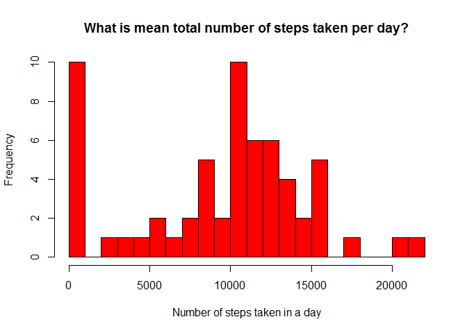
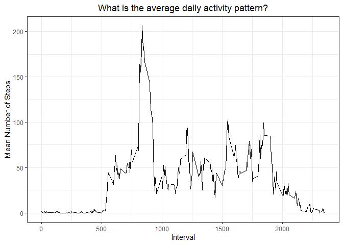
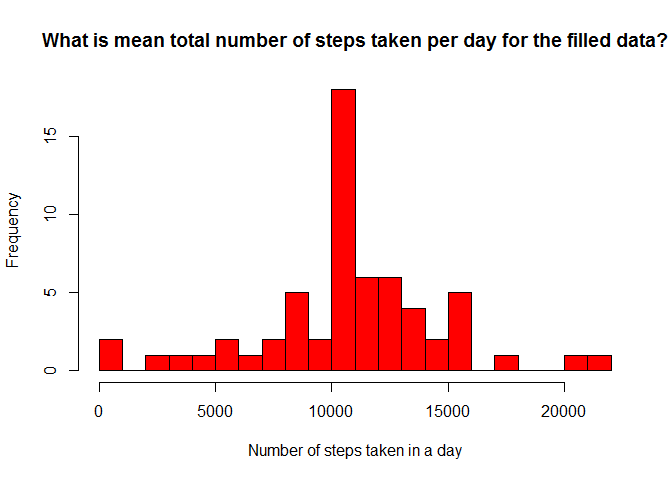
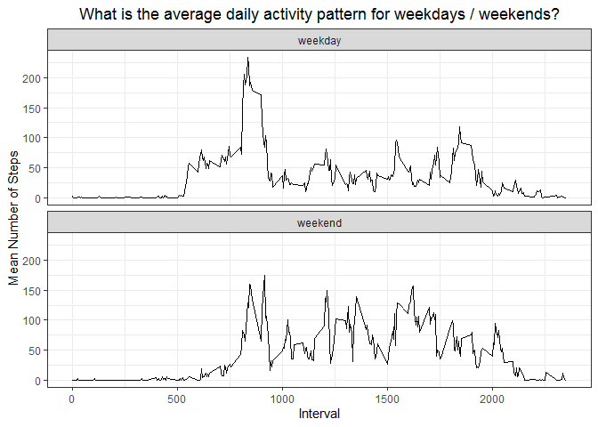

## Loading and preprocessing the data

```r
#I hide the outputs here because they are just warning or load messages
library(data.table)
library(ggplot2)

options(scipen = 999) #this is to discourage scientific notation in outputs

data_file <- "activity.csv"

data <- fread(data_file, header = T, sep = ",", na.strings = "NA")

#Format the date string as date
data[, date_formatted := strptime(date, format = "%Y-%m-%d")]

#Assign to each day if it's a weekday or a weekend (necessary for later)
Sys.setlocale(category = "LC_ALL", locale = "english") #this is to make sure the dates are shown in english
data[, weekday := weekdays(date_formatted)]
data$day_type <- "weekday"
data[weekday %in% c("Saturday", "Sunday"), day_type := "weekend"]
data$day_type <- factor(data$day_type, levels = c("weekday", "weekend"))

#Keep only necessary columns
data <- data[, .(steps, interval, date_formatted, day_type)]
```


```r
head(data)
```

```
##    steps interval date_formatted day_type
## 1:    NA        0     2012-10-01  weekday
## 2:    NA        5     2012-10-01  weekday
## 3:    NA       10     2012-10-01  weekday
## 4:    NA       15     2012-10-01  weekday
## 5:    NA       20     2012-10-01  weekday
## 6:    NA       25     2012-10-01  weekday
```

## What is mean total number of steps taken per day?

```r
steps_per_day <- data[, .(total_steps = sum(steps, na.rm = T)), by = date_formatted]

mean_steps_per_day <- mean(steps_per_day$total_steps)
median_steps_per_day <- median(steps_per_day$total_steps)

hist(steps_per_day$total_steps,
     col = "red",
     main = "What is mean total number of steps taken per day?",
     xlab = "Number of steps taken in a day",
     ylab = "Frequency",
     breaks = 20)
```

<!-- -->

(for the record, I almost did a "total_steps vs day" plot, but that would be a bar plot and the instructions said not to do that; still, the wording in the instructions could have been better)

The mean of the total number of steps taken per day is **9354.23**.  
The median of the total number of steps taken per day is **10395**.  

## What is the average daily activity pattern?

```r
steps_per_interval <- data[, .(mean_steps = mean(steps, na.rm = T)), by = interval]

interval_with_max_steps_start <- steps_per_interval[mean_steps == max(mean_steps)][1]$interval

p <- ggplot(data = steps_per_interval, aes(x = interval, y = mean_steps)) +
    geom_line() +
    theme_bw() +
    xlab("Interval") + ylab("Mean Number of Steps") +
    ggtitle("What is the average daily activity pattern?") +
    theme(plot.title = element_text(hjust = 0.5))
p
```

<!-- -->

The interval with the maximum average number of steps is the one starting at **835**.

## Inputing missing values


```r
#I've checked and NAs only show up in the steps column, so the total number is just
na_amount <- sum(is.na(data$steps))

#I'll fill the missing data using the mean steps for the corresponding interval
filled_data <- data
steps_per_interval <- data[, .(mean_steps = mean(steps, na.rm = T)), by = interval] #recalculate just in case

#(Here I could round the steps, but that would make me lose more information and for now I
#have no reason to do it. I'll do it later if it becomes necessary.)

filled_data <- merge(filled_data,
                     steps_per_interval,
                     by = "interval")
filled_data$steps <- as.numeric(filled_data$steps) #making it numeric to allow decimals
#Assign to the steps variable the mean_steps value for that interval only when the initial value was NA
filled_data[is.na(steps), steps := mean_steps] 

#Keep only necessary columns
filled_data <- filled_data[, .(steps, interval, date_formatted, day_type)]

head(filled_data)
```

```
##        steps interval date_formatted day_type
## 1:  1.716981        0     2012-10-01  weekday
## 2:  0.000000        0     2012-10-02  weekday
## 3:  0.000000        0     2012-10-03  weekday
## 4: 47.000000        0     2012-10-04  weekday
## 5:  0.000000        0     2012-10-05  weekday
## 6:  0.000000        0     2012-10-06  weekend
```


```r
#Calculate the same as "What is mean total number of steps taken per day?", but for the filled data
filled_steps_per_day <- filled_data[, .(total_steps = sum(steps, na.rm = T)), by = date_formatted]

filled_mean_steps_per_day <- mean(filled_steps_per_day$total_steps)
filled_median_steps_per_day <- median(filled_steps_per_day$total_steps)

hist(filled_steps_per_day$total_steps,
     col = "red",
     main = "What is mean total number of steps taken per day for the filled data?",
     xlab = "Number of steps taken in a day",
     ylab = "Frequency",
     breaks = 20)
```

<!-- -->

The mean of the total number of steps taken per day for the filled data is **10766.19**.  
The median of the total number of steps taken per day for the filled data is **10766.19**.  

Comparing with before, we can see that by filling the **NA** values instead of just ignoring them the mean increased by **1411.96**, while the median increased by **371.19**. However, I think that the largest impact is the one we can see in the histogram, where the number of days with no steps becomes a lot less frequent, and the whole distribution matches a bit more the likes of a "normal distribution" (which is also supported by the new mean being equal to the new median).

## Are there differences in activity patterns between weekdays and weekends?

```r
#Similar to "What is the average daily activity pattern?", but for every type of days
steps_per_interval_by_day_type <- data[, .(mean_steps = mean(steps, na.rm = T)), by = .(day_type, interval)]

p <- ggplot(data = steps_per_interval_by_day_type, aes(x = interval, y = mean_steps)) +
    geom_line() +
    facet_wrap(~day_type, nrow = 2, ncol = 1, strip.position = "top") +
    theme_bw() +
    xlab("Interval") + ylab("Mean Number of Steps") +
    ggtitle("What is the average daily activity pattern for weekdays / weekends?") +
    theme(plot.title = element_text(hjust = 0.5))

p
```

<!-- -->

